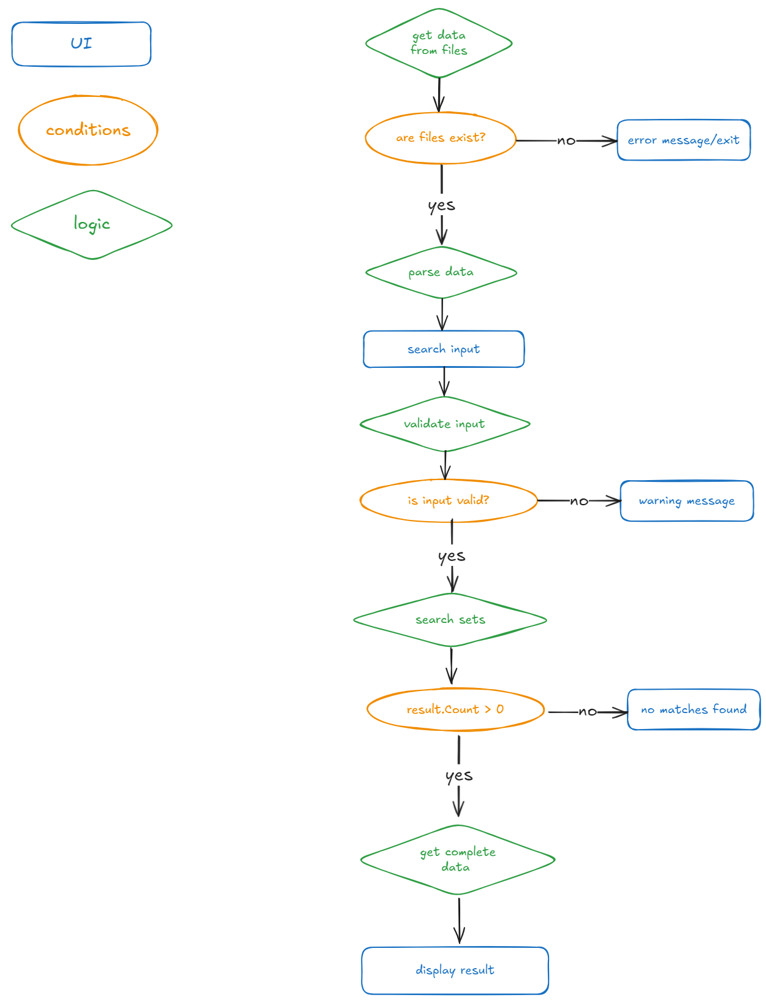

# MVC og LinQ utforsking

#### Goal

I denne oppgaven skal dere lage spørringer mot et csv datasett.

Lag en modell som representerer hver rad i csv filen, så en modell som representerer hele filen i helhet.
Se om dere klarer å lage en Controller, som skal styre input fra bruker til en spørring mot datafeltet.

# Lego Database

This console application allows users to search a LEGO set database by set name, set number, year or category name.  
It loads data from 2 CSV files, organizes it into models, and provides an interactive menu for searching sets efficiently.

### [Excalidraw file](https://excalidraw.com/#json=Srm0Ewh8nqO1PQGDRFyjI,-IhL-o4yVPK00pDWql8AHg)

